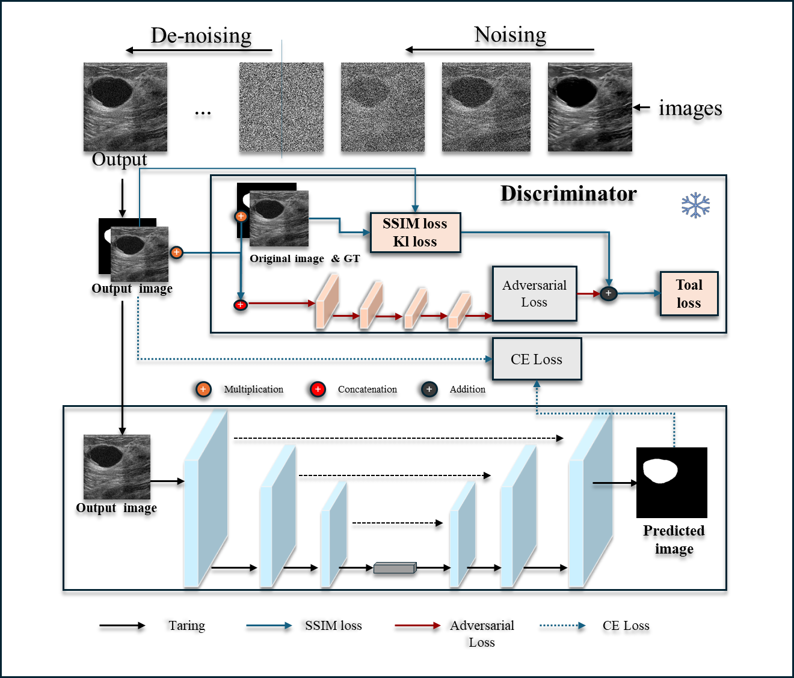

# Diffusion-U-Net-GAN for Ultrasound Tumor Segmentation

本项目基于扩散模型（Diffusion Model）结合 U-Net 和 GAN 判别器，用于超声图像中的肿瘤去噪与自动分割，适用于医学图像处理、智能诊断系统等场景。

---

## 📌 项目功能

- ✅ 超声图像去噪（Diffusion）
- ✅ 肿瘤区域精准分割（U-Net）
- ✅ 真实/伪生成图像判别（GAN）
- ✅ 云平台部署，图像识别结果实时展示
- ✅ 支持环境数据采集与预警推送

---

## 🧱 系统结构

```
感知层 → 网络层 → 平台层 → 应用层
图像采集 → WiFi+MQTT → 树莓派+云端 → 识别展示与预警
```

系统流程图：



---

## 📁 项目结构

```
├── models/             # 模型定义（Diffusion, U-Net, Discriminator）
├── datasets/           # 数据加载与预处理
├── train.py            # 训练主文件
├── predict.py          # 推理与结果保存
├── utils/              # 工具函数（可视化、loss 计算）
├── requirements.txt    # Python依赖
└── README.md
```

---

## 🚀 快速开始

### 1️⃣ 安装环境

```bash
conda create -n diffgan python=3.8
conda activate diffgan
pip install -r requirements.txt
```

### 2️⃣ 训练模型

```bash
python train.py --config config.yaml
```

### 3️⃣ 测试与分割展示

```bash
python predict.py --image sample.png
```

<!-- --- -->
<!-- 
## 📊 实验结果

| 模型      | 准确率 | 召回率 | mAP@0.5 |
|-----------|--------|--------|---------|
| YOLOv5    | 92.6%  | 90.1%  | 93.2%   |
| 本项目（Diff + U-Net + GAN）| **94.3%** | **92.5%** | **95.6%** |

---

## 🌐 可视化界面

本系统提供网页仪表盘，实时展示识别结果、环境数据、历史曲线与预警信息。

仪表盘界面示例：


---

## 📦 数据来源

- BUSI 数据集（乳腺超声）
- 自采图像：树莓派+摄像头+环境传感器

--- -->

## 🙋‍♀️ 项目作者

- **胡旭峰 Huxufeng**
- 📧 Email: `hxufneg66@gmail.com`
- GitHub: [Huxufeng666](https://github.com/Huxufeng666)

---

## 📄 License

本项目遵循 MIT 开源协议，欢迎使用、改进与引用。
